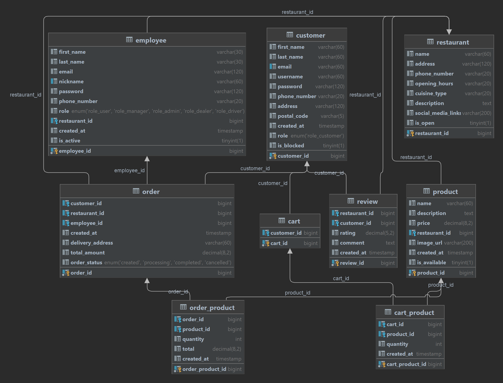

`001` SCHEMATIC DATABASE STRUCTURE **(TABLES)**

### erd schema

# 1. `carts` public class Cart {}

| `db_column_name` | `type`                   | Annotations                                                                                                                                    | Type variable       | Name variable |
|------------------|--------------------------|------------------------------------------------------------------------------------------------------------------------------------------------|---------------------|---------------|
| `cart_id`        | BINARY(16) PRIMARY KEY   | @GeneratedValue(generator = "UUID") @GenericGenerator(name = "UUID", type = UuidTimeSequenceGenerator.class) @Column(name = "cart_id") | `UUID`              | id            | 
| `customer_id`    | BINARY(16) NOT NULL      | @OneToOne(cascade = CascadeType.ALL) @JoinColumn(name = "customer_id", referencedColumnName = "customer_id")                               | `Customer`          | customer      | 
| `FOREIGN KEY`    | `cart_products_fk_carts` | @OneToMany(mappedBy = "cart", cascade = CascadeType.ALL)                                                                                       | `List<CartProduct>` | cartProducts  |

# 2. `cart_products` public class CartProduct {}

| `db_column_name`  | `type`                              | Annotations                                                                                                                                                    | __Type variable__ | Name variable |
|-------------------|-------------------------------------|----------------------------------------------------------------------------------------------------------------------------------------------------------------|-------------------|---------------|
| `cart_product_id` | BINARY(16) PRIMARY KEY              | @Id @GeneratedValue(generator = "UUID") @GenericGenerator(name = "UUID", type = UuidTimeSequenceGenerator.class) @Column(name = "cart_product_id") | `UUID`            | id            | 
| `cart_id`         | BINARY(16) NOT NULL                 | @ManyToOne(fetch = FetchType.LAZY) @JoinColumn(name = "cart_id") @NotNull(message = "{Cart cannot be null}")                                           | `Cart`            | cart          | 
| `product_id`      | BIGINT                              | @ManyToOne(fetch = FetchType.LAZY) @JoinColumn(name = "product_id") @NotNull(message = "{validation.cart.product.null}")                               | `Product`         | product       | 
| `quantity`        | INT                                 | @Column(name = "quantity") @NotNull(message = "{Product cannot be null}")                                                                                  | `int`             | quantity      | 
| `created_at`      | TIMESTAMP DEFAULT CURRENT_TIMESTAMP | @Column(name = "created_at", columnDefinition = "TIMESTAMP DEFAULT CURRENT_TIMESTAMP")                                                                         | `LocalDateTime`   | createdAt     |

# 3. `customers` public class Customers {}

| `db_column_name` | `type`                                        | Annotations                                                                                                                                                | Type variable   | Name variable |
|------------------|-----------------------------------------------|------------------------------------------------------------------------------------------------------------------------------------------------------------|-----------------|---------------|
| `customer_id`    | BINARY(16) PRIMARY KEY                        | @Id @GeneratedValue(generator = "UUID") @GenericGenerator(name = "UUID", type = UuidTimeSequenceGenerator.class) @Column(name = "customer_id") | `UUID`          | id            | 
| `first_name`     | VARCHAR(30)                                   | @Column(name = "first_name")                                                                                                                               | `String`        | firstName     | 
| `last_name`      | VARCHAR(30)                                   | @Column(name = "last_name")                                                                                                                                | `String`        | lastName      |
| `email`          | VARCHAR(60)                                   | @Column(name = "email")                                                                                                                                    | `String`        | email         |
| `password`       | VARCHAR(60)                                   | @Column(name = "password")                                                                                                                                 | `String`        | password      |
| `phone_number`   | VARCHAR(15)                                   | Column(name = "phone_number")                                                                                                                              | `String`        | phoneNumber   |
| `address`        | VARCHAR(120)                                  | @Column(name = "address")                                                                                                                                  | `String`        | address       |
| `postal_code`    | VARCHAR(5)                                    | @Column(name = "postal_code")                                                                                                                              | `String`        | postalCode    |
| `created_at`     | TIMESTAMP DEFAULT CURRENT_TIMESTAMP           | @Column(name = "created_at", columnDefinition = "TIMESTAMP DEFAULT CURRENT_TIMESTAMP")                                                                     | `LocalDateTime` | createdAt     |
| `updated_at`     | TIMESTAMP                                     | @Column(name = "updated_at")                                                                                                                               | `LocalDateTime` | updatedAt     |
| `role`           | ENUM('ROLE_CUSTOMER') DEFAULT 'ROLE_CUSTOMER' | @Column(name = "role") @Enumerated(EnumType.STRING)                                                                                                    | `RolesName`     | role          |
| `is_blocked`     | BOOL DEFAULT FALSE                            | @Column(name = "is_blocked")                                                                                                                               | `Boolean`       | isBlocked     |
| `FOREIGN KEY`    | `carts_fk_customers`                          | @OneToOne(mappedBy = "customer", cascade = CascadeType.ALL)                                                                                                | `Cart`          | cart          |
| `FOREIGN KEY`    | `orders_fk_customers`                         | @OneToMany(mappedBy = "customer", cascade = CascadeType.ALL)                                                                                               | `List<Order>`   | orders        |
| `FOREIGN KEY`    | `reviews_fk_customers`                        | @OneToMany(mappedBy = "customer", cascade = CascadeType.ALL)                                                                                               | `List<Review>`  | reviews       |

# 4. `reviews` public class Reviews {}

| `db_column_name` | `type`                                     | Annotations                                                                                 | Type variable   | Name variable |
|------------------|--------------------------------------------|---------------------------------------------------------------------------------------------|-----------------|---------------|
| `review_id`      | BIGINT NOT NULL AUTO_INCREMENT PRIMARY KEY | @GeneratedValue(strategy = GenerationType.IDENTITY)  @Column(name = "review_id")        | `Long`          | id            | 
| `restaurant_id`  | BIGINT                                     | @ManyToOne(fetch = FetchType.LAZY)  @JoinColumn(name = "restaurant_id")                 | `Restaurant`    | restaurant    | 
| `customer_id`    | BINARY(16) NOT NULL                        | @ManyToOne(fetch = FetchType.LAZY) @JoinColumn(name = "customer_id")                    | `Customer`      | customer      |
| `rating`         | DECIMAL(5, 2)                              | @Column(name = "rating", precision = 5, scale = 2)                                          | `BigDecimal`    | rating        |
| `comment`        | TEXT                                       | @Column(name = "comment")                                                                   | `String`        | comment       |
| `created_at`     | TIMESTAMP DEFAULT CURRENT_TIMESTAMP        | @Column(name = "created_at", columnDefinition = "TIMESTAMP DEFAULT CURRENT_TIMESTAMP")  | `LocalDateTime` | createdAt     |
| `updated_at`     | TIMESTAMP                                  | @Column(name = "updated_at")                                                                | `LocalDateTime` | updatedAt     |

# 5. `orders` public class Orders {}

| `db_column_name`   | `type`                                                             | Annotations                                                                                                                                             | Type variable        | Name variable   |
|--------------------|--------------------------------------------------------------------|---------------------------------------------------------------------------------------------------------------------------------------------------------|----------------------|-----------------|
| `order_id`         | BINARY(16) PRIMARY KEY                                             | @Id @GeneratedValue(generator = "UUID") @GenericGenerator(name = "UUID", type = UuidTimeSequenceGenerator.class) @Column(name = "order_id") | `UUID`               | id              |
| `customer_id`      | BINARY(16) NOT NULL                                                | @JoinColumn(name = "customer_id") @ManyToOne(fetch = FetchType.LAZY)                                                                                | `Customer`           | customer        |
| `restaurant_id`    | BIGINT                                                             | @JoinColumn(name = "restaurant_id")                                                                                                                     | `Restaurant`         | restaurant      |
| `employee_id`      | BINARY(16)                                                         |                                                                                                                                                         |                      |                 |
| `created_at`       | TIMESTAMP DEFAULT CURRENT_TIMESTAMP                                | @Column(name = "created_at", columnDefinition = "TIMESTAMP DEFAULT CURRENT_TIMESTAMP")                                                                  | `LocalDateTime`      | createdAt       |
| `update_at`        | TIMESTAMP                                                          | @Column(name = "update_at", columnDefinition = "TIMESTAMP")                                                                                             | `LocalDateTime`      | updateAt        |
| `delivery_address` | VARCHAR(60)                                                        | @Column(name = "delivery_address")                                                                                                                      | `String`             | deliveryAddress |
| `postal_code`      | VARCHAR(5)                                                         | @Column(name = "postal_code")                                                                                                                           | `String`             | postalCode      |
| `total_amount`     | DECIMAL(8, 2)                                                      | @Column(name = "total_amount", precision = 8, scale = 2)                                                                                                | `BigDecimal`         | totalAmount     |
| `order_status`     | ENUM('CREATED', 'COOKING', 'DELIVERING', 'COMPLETED', 'CANCELLED') | @Column(name = "order_status") @Enumerated(EnumType.STRING)                                                                                         | `OrderStatus`        | orderStatus     |
| `FOREIGN KEY`      | `order_products_fk_orders`                                         | @OneToMany(mappedBy = "order", cascade = CascadeType.ALL)                                                                                               | `List<OrderProduct>` | orderProducts   |

# 6. `orders` public class OrderProduct {}

| `order_products`   | `type`                 | Annotations                                                                                                                                                     | Type variable | Name variable |
|--------------------|------------------------|-----------------------------------------------------------------------------------------------------------------------------------------------------------------|---------------|---------------|
| `order_product_id` | BINARY(16) PRIMARY KEY | @Id @GeneratedValue(generator = "UUID") @GenericGenerator(name = "UUID", type = UuidTimeSequenceGenerator.class) @Column(name = "order_product_id") | `UUID`        | id            | 
| `order_id`         | BINARY(16) NOT NULL    | @Column(name = "quantity")                                                                                                                                      | `int`         | quantity      |
| `product_id`       | BIGINT                 | @ManyToOne(fetch = FetchType.LAZY) @JoinColumn(name = "order_id")                                                                                           | `Order`       | order         |
| `quantity`         | INT                    | @ManyToOne(fetch = FetchType.LAZY) @JoinColumn(name = "product_id")                                                                                         | `Product`     | product       |

# 7. `products` public class Product {}

| `order_products` | `type`                                     | Annotations                                                                                  | Type variable        | Name variable |
|------------------|--------------------------------------------|----------------------------------------------------------------------------------------------|----------------------|---------------|
| `product_id`     | BIGINT NOT NULL AUTO_INCREMENT PRIMARY KEY | @Id @GeneratedValue(strategy = GenerationType.IDENTITY) @Column(name = "product_id") | `Long`               | id            |
| `name`           | VARCHAR(60)                                | @Column(name = "name")                                                                       | `String`             | name          |
| `description`    | TEXT                                       | @Column(name = "description")                                                                | `String`             | description   |
| `price`          | DECIMAL(8, 2)                              | @Column(name = "price", precision = 8, scale = 2)                                            | `BigDecimal`         | price         |
| `restaurant_id`  | BIGINT                                     | @ManyToOne(fetch = FetchType.LAZY) @JoinColumn(name = "restaurant_id")                   | `String`             | restaurant    |
| `image_url`      | VARCHAR(200)                               | @Column(name = "image_url")                                                                  | `String`             | imageUrl      |
| `created_at`     | TIMESTAMP DEFAULT CURRENT_TIMESTAMP        | @Column(name = "created_at", columnDefinition = "TIMESTAMP DEFAULT CURRENT_TIMESTAMP")       | `LocalDateTime`      | createdAt     |
| `is_available`   | BOOL DEFAULT TRUE                          | @Column(name = "is_available")                                                               | `String`             | isAvailable   |
| `FOREIGN KEY`    | `cart_products_fk_products`                | @OneToMany(mappedBy = "product", cascade = CascadeType.ALL)                                  | `List<CartProduct>`  | cartProducts  |
| `FOREIGN KEY`    | `order_products_fk_products`               | @OneToMany(mappedBy = "product", cascade = CascadeType.ALL)                                  | `List<OrderProduct>` | orderProducts |

# 8. `reviews` public class Review {}

| `order_products` | `type`                                     | Annotations                                                                                 | Type variable   | Name variable |
|------------------|--------------------------------------------|---------------------------------------------------------------------------------------------|-----------------|---------------|
| `review_id`      | BIGINT NOT NULL AUTO_INCREMENT PRIMARY KEY | @Id @GeneratedValue(strategy = GenerationType.IDENTITY) @Column(name = "review_id") | `Long`          | id            |
| `restaurant_id`  | BIGINT                                     | @ManyToOne(fetch = FetchType.LAZY) @JoinColumn(name = "restaurant_id")                  | `Restaurant`    | restaurant    |
| `customer_id`    | BINARY(16) NOT NULL                        | @ManyToOne(fetch = FetchType.LAZY) @JoinColumn(name = "customer_id")                    | `Customer`      | customer      |
| `rating`         | DECIMAL(5, 2)                              | @Column(name = "rating", precision = 5, scale = 2)                                          | `BigDecimal`    | rating        |
| `comment`        | TEXT                                       | @Column(name = "comment")                                                                   | `String`        | comment       |
| `created_at`     | TIMESTAMP DEFAULT CURRENT_TIMESTAMP        | @Column(name = "created_at", columnDefinition = "TIMESTAMP DEFAULT CURRENT_TIMESTAMP")      | `LocalDateTime` | createdAt     |
| `updated_at`     | TIMESTAMP                                  | @Column(name = "updated_at")                                                                | `LocalDateTime` | updatedAt     |

